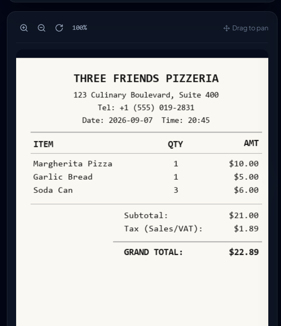
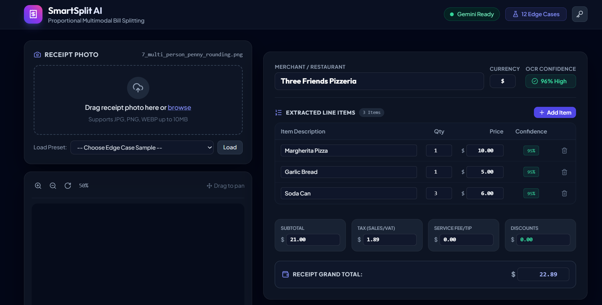
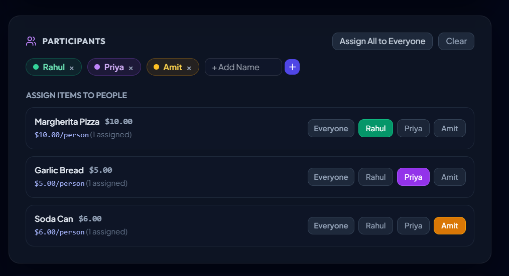

# SmartSplit: Split the Bill From a Photograph
> **Production-ready AI web application that parses receipt photos, extracts line items & taxes using Google Gemini Vision, provides human-in-the-loop verification, and calculates mathematically sound proportional bill splits with penny-perfect reconciliation.**

[](https://fastapi.tiangolo.com)
[](https://python.org)
[](https://ai.google.dev)
[](https://tailwindcss.com)
[](https://pytest.org)
[](#c-penny-perfect-reconciliation-hare-niemeyer-algorithm)

---

## 1. Application Overview & Visual Workflow

SmartSplit AI bridges multimodal computer vision and precision financial mathematics to eliminate the friction and unfairness of splitting dining and shopping receipts.

### Visual Workflow

The user journey transitions seamlessly from image upload through interactive review to high-resolution export:

<div align="center">
  
  <p><em>Figure 1: Receipt Photo Input & Interactive Canvas Viewer (Zoom, Pan, Rotate)</em></p>
</div>

```
+---------------------+     +--------------------------+     +------------------------+
| 1. Receipt Upload   | --> | 2. Gemini Multimodal OCR | --> | 3. Human Review Studio |
| (Drag/Drop/Presets) |     | (Line Items & Taxes JSON)|     | (Confidence Warnings)  |
+---------------------+     +--------------------------+     +------------------------+
                                                                         |
                                                                         v
+---------------------+     +--------------------------+     +------------------------+
| 6. Image & Text     | <-- | 5. Penny Reconciliation  | <-- | 4. Person Assignment   |
| (PNG Download/Copy) |     | (Hare-Niemeyer Algorithm)|     | (Single / Multi / All) |
+---------------------+     +--------------------------+     +------------------------+
```

---

## 2. Mathematical Foundation & Fairness Proof

Splitting restaurant and grocery bills equally across participants introduces substantial financial unfairness whenever consumption is asymmetric.

### A. The Flaw of Equal Fee Division
Suppose Person A orders a \$10 snack and Person B orders an \$90 steak (Food Subtotal = \$100). The restaurant assesses a 10% sales tax (\$10.00).
- **Equal Fee Split (Unfair)**: Each person pays \$5.00 tax. Person A pays \$15.00 (a **50% tax rate** on their food). Person B pays \$95.00 (a **5.5% tax rate** on their food).
- **Proportional Fee Split (SmartSplit AI)**: Tax, service charges, and discounts are distributed strictly proportional to raw food subtotal consumed.
  - Person A consumes $\frac{\$10}{\$100} = 10\%$ of food $\rightarrow$ Pays $10\% \times \$10.00 = \$1.00$ tax $\rightarrow$ Final: **\$11.00**.
  - Person B consumes $\frac{\$90}{\$100} = 90\%$ of food $\rightarrow$ Pays $90\% \times \$10.00 = \$9.00$ tax $\rightarrow$ Final: **\$99.00**.

### B. The Proportional Splitting Formula
For participant $i$ consuming a set of items with individual share fractions:
$$\text{Food Subtotal}_i = \sum_{k \in \text{Items}_i} \frac{\text{Price}_k}{\text{Participants Assigned to } k}$$

$$\text{Fee Share}_i = \text{Total Net Fees} \times \left( \frac{\text{Food Subtotal}_i}{\text{Receipt Food Subtotal}} \right)$$

$$\text{Final Total}_i = \text{Food Subtotal}_i + \text{Fee Share}_i$$

where:
$$\text{Total Net Fees} = \text{Taxes} + \text{Service Charge} - \text{Discounts}$$

### C. Penny-Perfect Reconciliation (Hare-Niemeyer Algorithm)
When sharing items among $N$ participants (e.g. 3 people sharing a \$10 dish $\rightarrow \$3.3333\dots$), converting continuous shares to integer cents produces fractional rounding discrepancies.
SmartSplit AI employs the **Largest Remainder Method (Hare-Niemeyer)**:
1. Compute exact continuous shares $E_i = \text{Final Total}_i \times 100$ (in cents).
2. Floor each participant's share: $I_i = \lfloor E_i \rfloor$, tracking remainder fractions $R_i = E_i - I_i$.
3. Compute the penny discrepancy $\Delta = (\text{Receipt Grand Total} \times 100) - \sum I_i$.
4. Award the $\Delta$ remainder cents to the participants having the largest fractional remainders $R_i$.
5. **Guaranteed Invariant**:
   $$\sum_{i=1}^N \text{Final Total}_i \equiv \text{Receipt Grand Total} \quad (\text{exact down to the cent})$$

---

## 3. Human-in-the-Loop Review System

Computer vision on real-world receipts faces challenges such as crumpling, fading, and tilted camera shots. SmartSplit AI builds user trust through transparency and interactive correction:

### A. OCR Extraction Studio
Each extracted field carries an individual AI confidence score ($0.0$ to $1.0$). Fields with confidence $< 0.80$ are highlighted in soft yellow/amber warning states with pulse animations, prompting human inspection.

<div align="center">
  
  <p><em>Figure 2: Human-in-the-Loop Line Item Editor with Confidence Indicators & Mismatch Alerts</em></p>
</div>

- **Confidence Scores per Field**: Item descriptions, quantities, prices, subtotal, and taxes each report extraction certainty.
- **Printed Math Discrepancy Detection**: If printed items sum does not equal printed subtotal:
  $$\left| \sum \text{Items} - \text{Subtotal} \right| > 0.05 \implies \text{math\_mismatch\_warning: true}$$
  A 1-click **"Sync Subtotal with Items Sum"** button instantly reconciles the subtotal.

### B. Interactive Participant Assignment
Add participants dynamically with distinct color-coded chips (e.g. Rahul, Priya, Amit, Kavita). Assign items to **One Person**, **Multiple People** (cost split equally), or **Everyone** with one click.

<div align="center">
  
  <p><em>Figure 3: Participant Manager & Interactive Item Assignment Matrix</em></p>
</div>

### C. Proportional Split Breakdown & Image Export
The output summary shows an itemized breakdown for each person with proportional fee distribution, real-time penny verification, and a high-resolution PNG image download.

<div align="center">
  
  <p><em>Figure 4: Proportional Split Breakdown with Penny-Perfect Verification & Image Export</em></p>
</div>

- **Download Image**: Captures the entire breakdown card via `html2canvas` in 2x DPI and automatically triggers download of `bill_split_breakdown.png`.
- **Copy Text**: Formats a WhatsApp/Slack message summary ready to share in group chats.

---

## 4. The 12 Edge Cases Suite

The application includes an edge-case modal gallery and test generator supporting 12 real-world receipt challenges:

<div align="center">
  
  <p><em>Figure 5: 12 Edge Cases Gallery with 1-Click Interactive Presets</em></p>
</div>

| # | Edge Case ID | Name | Description & Verification Goal |
|---|---|---|---|
| 1 | `1_crumpled_paper` | Crumpled Paper Receipt | Degraded, folded receipt paper with wrinkles and shadows affecting OCR clarity. |
| 2 | `2_angled_shot` | Angled Perspective Shot | Camera photo taken at an angle with tilted perspective distortion. |
| 3 | `3_incorrect_printed_math` | Incorrect Printed Math | Cash register error where printed items sum to \$38.00 but printed subtotal is \$42.00. Triggers `math_mismatch_warning: true`. |
| 4 | `4_heavy_discounts` | Heavy Discounts & Vouchers | Bill with substantial promo deduction (-\$35.00) that proportionally reduces participant shares. |
| 5 | `5_zero_tax_service_only` | Zero Tax (Service Only) | Duty-free receipt with 0% sales tax but 12% mandatory service charge. |
| 6 | `6_high_tax_multiple_rates` | Compound Tax Rates | Composite multi-rate taxes (e.g., State 6.25% + Local Meal 2.75% = 9.0% total). |
| 7 | `7_multi_person_penny_rounding` | Multi-Person Penny Rounding | \$10.00 split 3 ways yields \$3.3333. Hare-Niemeyer cent balancing allocates the extra 1 cent without loss. |
| 8 | `8_foreign_currency_symbols` | Foreign Currency (€ / ₹) | International receipt with € (Euro) formatting and European decimal comma support. |
| 9 | `9_handwritten_additions` | Handwritten Tip Addition | Receipt with printed total and customer handwritten tip added in blue pen. |
| 10 | `10_faded_thermal_ink` | Faded Thermal Ink | Low-contrast faded register ink testing low-confidence flags (< 0.80). |
| 11 | `11_single_item_expensive` | Asymmetric Pricing Fairness | One person orders \$120 wine, others have \$12 fries. Confirms proportional tax equity. |
| 12 | `12_zero_food_subtotal` | Zero Food Subtotal | Venue cover fee / table reservation with \$0 food items. Tests fallback equal fee distribution. |

---

## 5. Quickstart & Installation

### Step 1: Install Dependencies
```powershell
pip install fastapi uvicorn pydantic google-genai pillow python-multipart python-dotenv pytest httpx
```

### Step 2: Configure Environment
Create or edit `.env` in the root directory:
```bash
GEMINI_API_KEY=AIzaSy...your_gemini_api_key_here
```
*(Note: If you do not have an API key, the application runs seamlessly using the 12 built-in edge case presets, or you can paste your key in the web UI settings modal at runtime!)*

### Step 3: Run the Application Server
```powershell
python -m uvicorn backend.app:app --host 127.0.0.1 --port 8001 --reload
```
Open your browser and navigate to:
```
http://127.0.0.1:8001
```

---

## 6. Running Automated Tests

Run the complete test suite covering the proportional math engine, Hare-Niemeyer cent balancing, API endpoints, and all 12 edge cases:

```powershell
python -m pytest test_bills/ tests/ -v
```

All 12 automated tests will execute and validate:
- Zero-penny loss invariants.
- Proportional fairness checks.
- Discrepancy detection on bad printed receipts.
- Static frontend serving and REST endpoints.

---

## 7. REST API Reference

### `POST /api/extract`
Upload a receipt photo to extract structured line items and taxes.
- **Request**: `multipart/form-data` with `file: UploadFile` (JPG, PNG, WEBP).
- **Headers (Optional)**: `X-Gemini-API-Key: <key>`.
- **Query Params (Optional)**: `mock_edge_case=<id>`.
- **Response**: `ReceiptExtractionResult` JSON with confidence scores and mismatch warnings.

### `POST /api/split`
Calculates proportional shares with cent balancing.
- **Request Body**:
  ```json
  {
    "receipt_data": { ... },
    "participants": [
      { "id": "p1", "name": "Rahul" },
      { "id": "p2", "name": "Priya" }
    ],
    "assignments": [
      { "item_index": 0, "assigned_participant_ids": ["p1", "p2"] }
    ]
  }
  ```
- **Response**: `SplitResponse` JSON showing each participant's consumed items, base food subtotal, proportional fee share, and final total.

### `GET /api/sample-receipts`
Returns metadata and ground truth for all 12 edge cases.

### `GET /api/health`
Status and Gemini API key configuration check.
